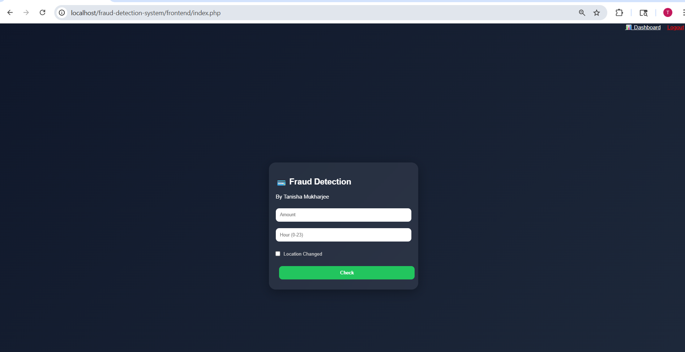
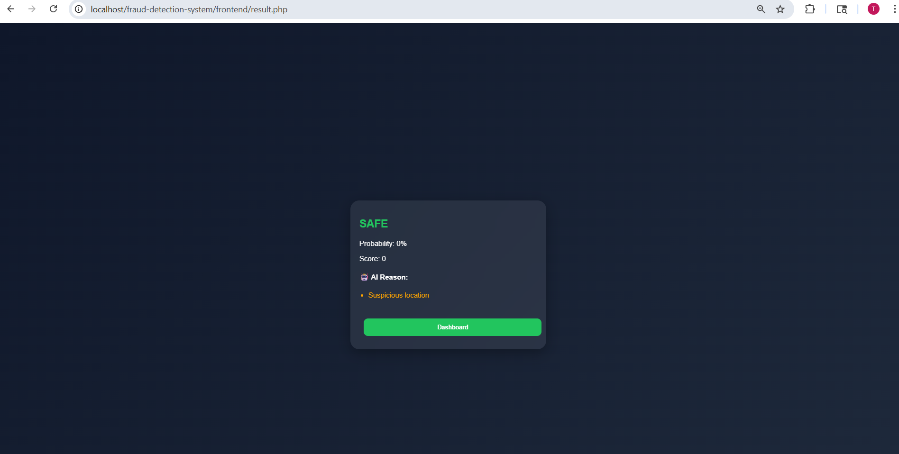
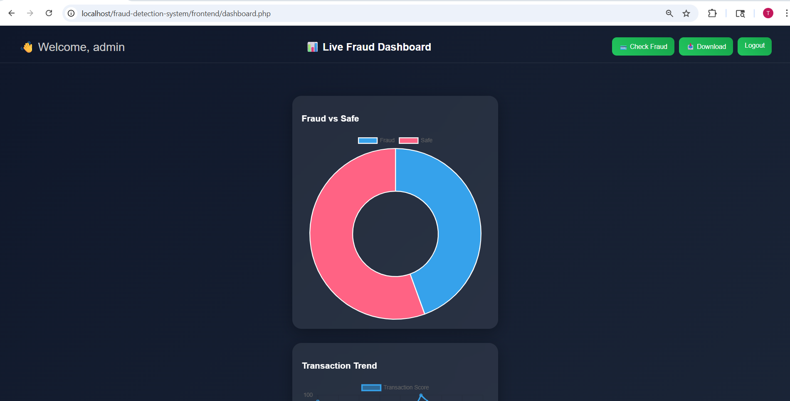
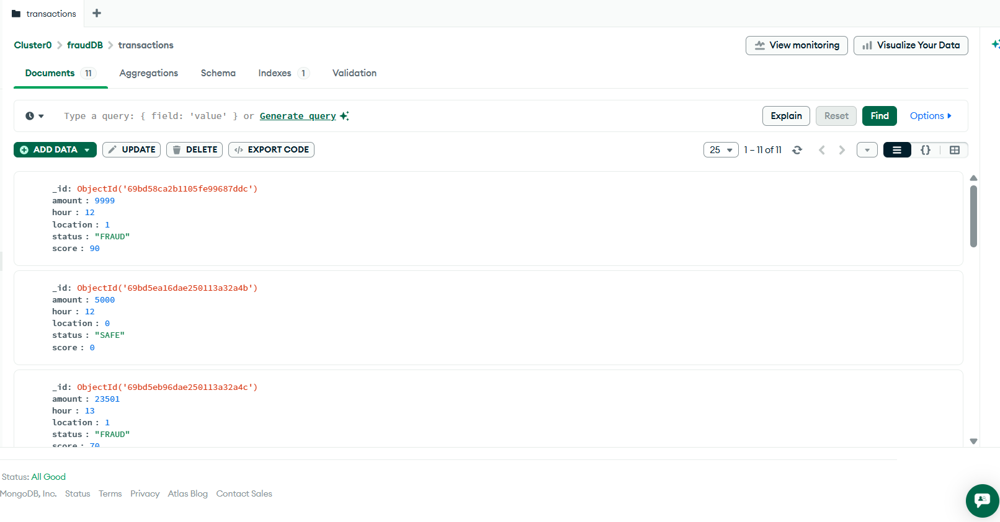

# 💳 AI Fraud Detection System

---

## 🛡️ AI Fraud Detection System

A Machine Learning-powered fraud detection system with real-time transaction analysis, dashboard visualization, MongoDB logging, and interactive UI.

---

## 🚀 Features

### 🔍 Fraud Detection

* Predicts whether a transaction is **Fraud 🚨** or **Safe ✔**
* Accepts user inputs (Amount, Time, Location)
* Real-time prediction using ML + rule-based logic
* Displays probability score and AI-generated reasons

---

### 🤖 Machine Learning

* Random Forest Classifier (Scikit-learn)
* Feature scaling using StandardScaler
* Handles **30-feature input vector**
* Hybrid system:

  * ML prediction
  * Rule-based fallback (for robustness)

Model files:

* `model.pkl`
* `scaler.pkl`

---

### 🍃 MongoDB Logging

Each transaction is stored in MongoDB Atlas:

| Field    | Description         |
| -------- | ------------------- |
| Amount   | Transaction amount  |
| Hour     | Time of transaction |
| Location | Location flag       |
| Status   | Fraud / Safe        |
| Score    | Risk score          |

---

### 📊 Dashboard

A modern **glassmorphism UI dashboard** with:

* 📊 Fraud vs Safe Pie Chart (Chart.js)
* 📈 Transaction Trend Line Chart
* 📋 Live Transaction Table
* 🔄 Auto-refresh (real-time updates)
* 🚨 Fraud Alert Popup
* 📥 Export transactions as CSV

---

### 🎨 UI Features

* Glassmorphism design
* Responsive layout
* Smooth animations
* Clean user experience

---

## 🖼️ Screenshots

## 📸 Screenshots

### 🏠 Home Page


### 🤖 Result Page


### 📊 Dashboard

(Screenshots/dashboard2.png)

### 🗄️ MongoDB Data


---

## 🧰 Tech Stack

| Layer            | Technologies                              |
| ---------------- | ----------------------------------------- |
| Frontend         | HTML, CSS, JavaScript, PHP                |
| Backend          | Flask (Python)                            |
| Machine Learning | Scikit-learn, NumPy                       |
| Database         | MongoDB Atlas                             |
| Charts           | Chart.js                                  |
| Deployment       | Render (Backend), InfinityFree (Frontend) |

---

## 📁 Project Structure

```
fraud-detection-system/
│
├── backend/
│   ├── app.py
│   ├── model/
│   │   ├── model.pkl
│   │   └── scaler.pkl
│   ├── requirements.txt
│
├── frontend/
│   ├── index.php
│   ├── dashboard.php
│   ├── result.php
│   ├── login.php
│   ├── logout.php
│   ├── style.css
│   ├── download.php
│
├── README.md
└── .gitignore
```

---

## ⚙️ Installation & Running

### 🔹 Backend (Flask)

```bash
cd backend
pip install -r requirements.txt
python app.py
```

---

### 🔹 Frontend (XAMPP)

1. Move project to:

```
C:\xampp\htdocs\
```

2. Start Apache

3. Open:

```
http://localhost/fraud-detection-system/frontend
```

---

## 🌐 API Endpoints

| Endpoint       | Method | Description             |
| -------------- | ------ | ----------------------- |
| `/predict`     | POST   | Predict fraud           |
| `/get-data`    | GET    | Fetch dashboard data    |
| `/test-insert` | GET    | Insert test transaction |

---

## 🧠 Model Training

To retrain model:

```bash
python train.py
```

Outputs:

* `model.pkl`
* `scaler.pkl`

---

## 🍃 MongoDB Setup

Update connection string in `app.py`:

```python
MongoClient("YOUR_MONGODB_ATLAS_URL")
```

Make sure:

* IP is whitelisted
* Credentials are correct

---

## 🌐 Deployment

### Backend:

* Render

### Frontend:

* InfinityFree

---

## 💼 Resume Description

Developed a full-stack AI-powered fraud detection system using Flask, PHP, and MongoDB Atlas. Implemented machine learning-based prediction with real-time dashboard visualization, anomaly detection, and cloud-based deployment.

---

## 👩‍💻 Author

**Tanisha Mukharjee**
🔗 GitHub: https://github.com/tanisha-mukharjee

---

## ⭐ Future Enhancements

* Deep Learning Model Integration
* Real-time streaming (WebSockets)
* Advanced anomaly detection
* User authentication system
* Mobile-friendly UI

---

## 📌 Conclusion

This project demonstrates the practical use of AI in financial fraud detection by combining machine learning, real-time APIs, and interactive dashboards.

---

⭐ If you like this project, don’t forget to star it!
